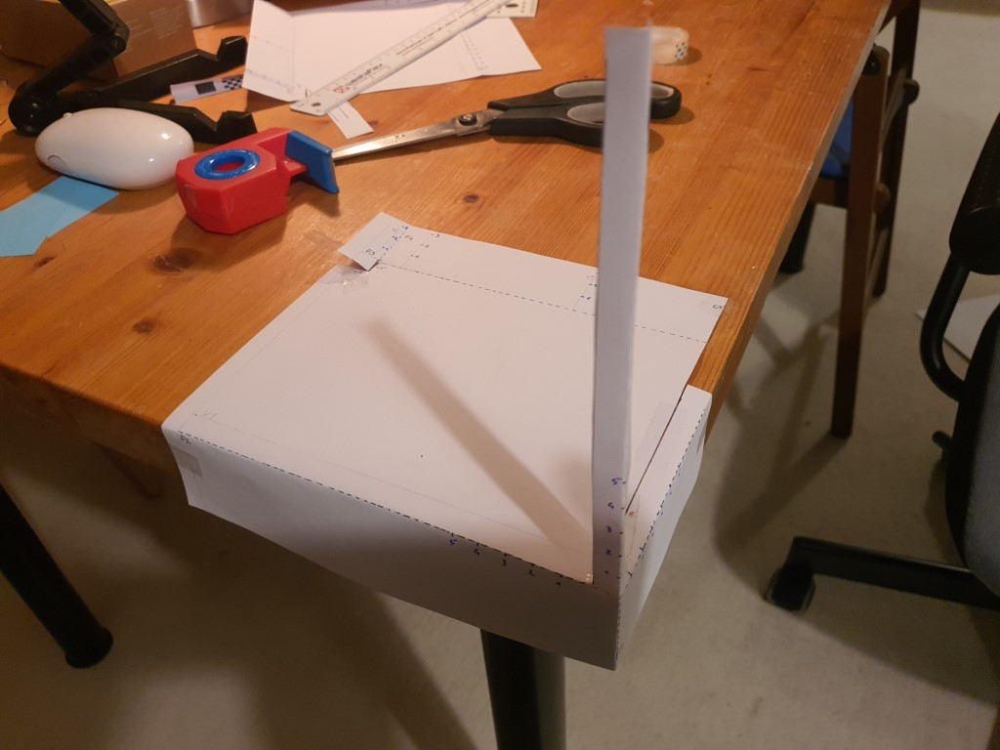
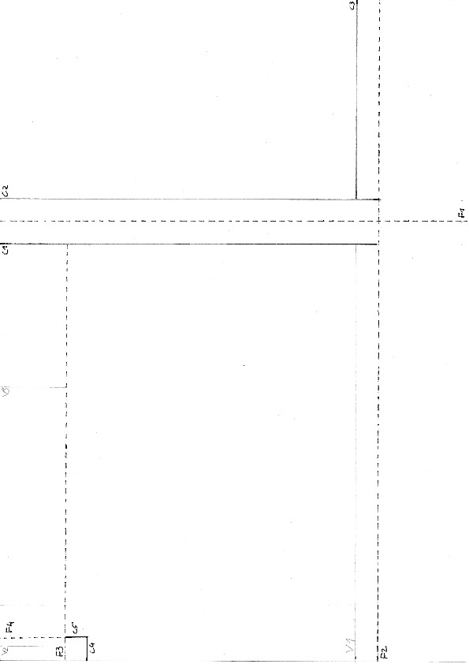
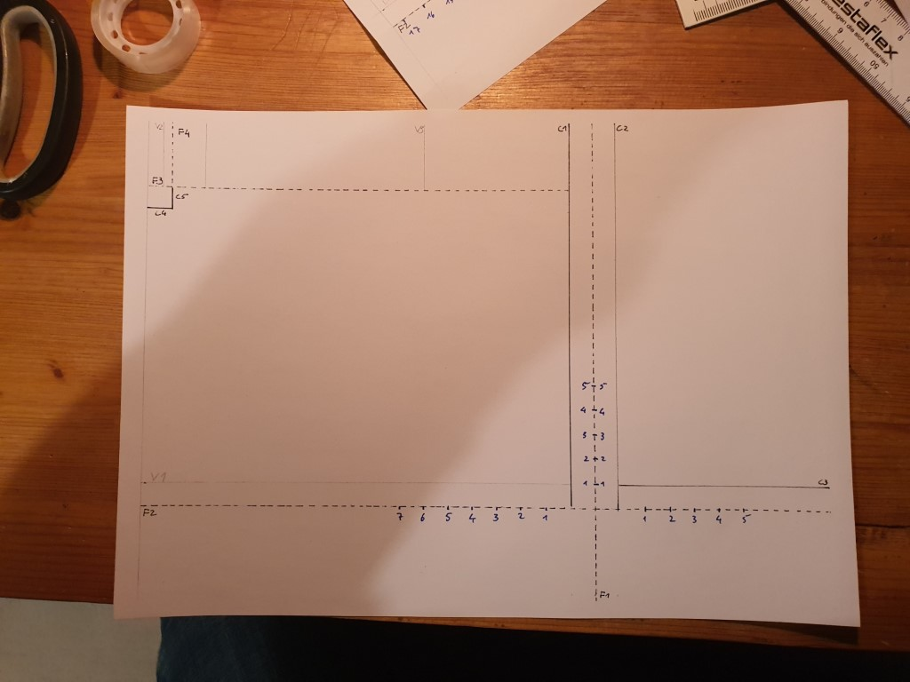
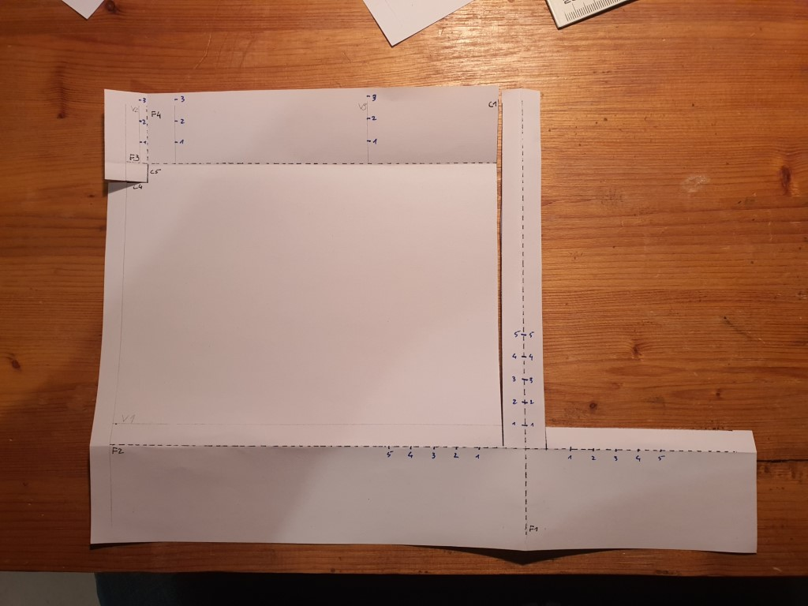
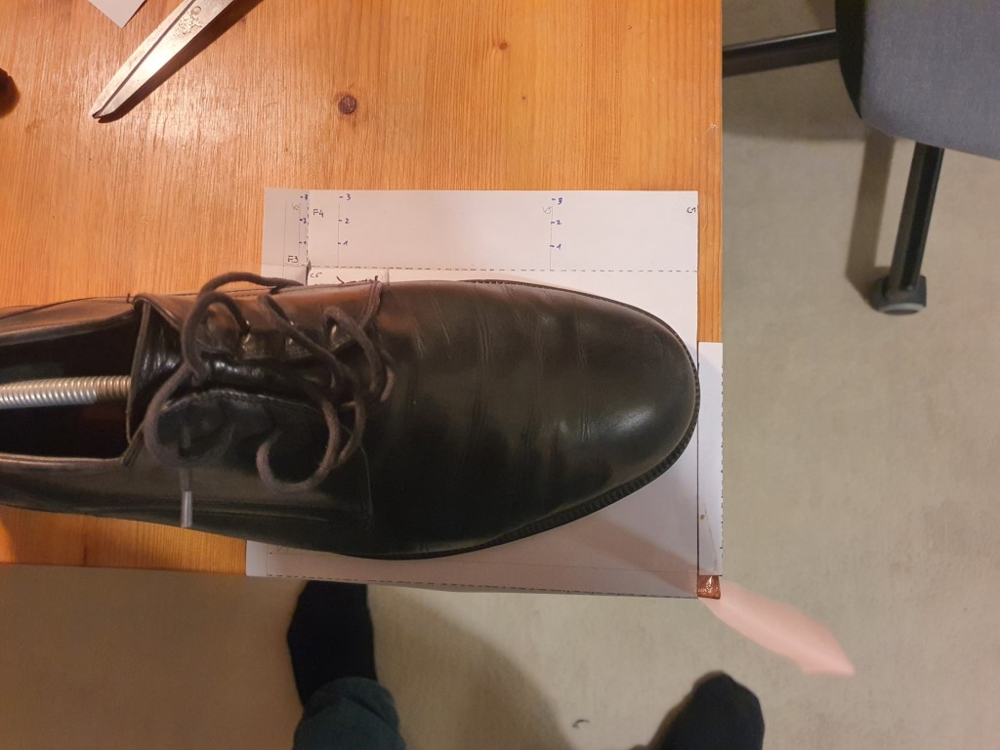
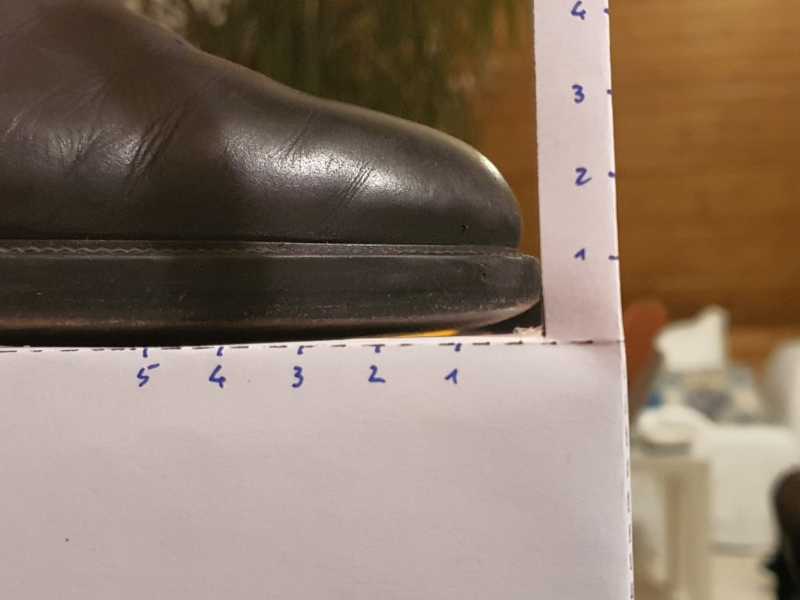
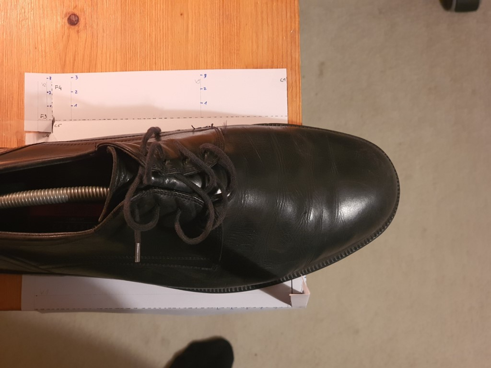
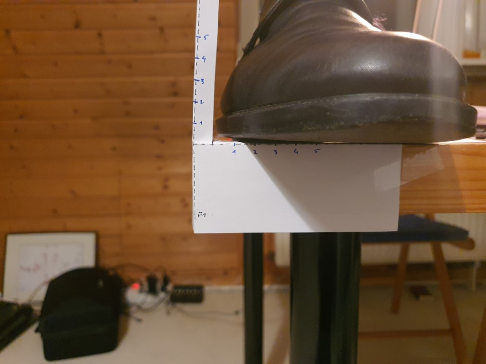
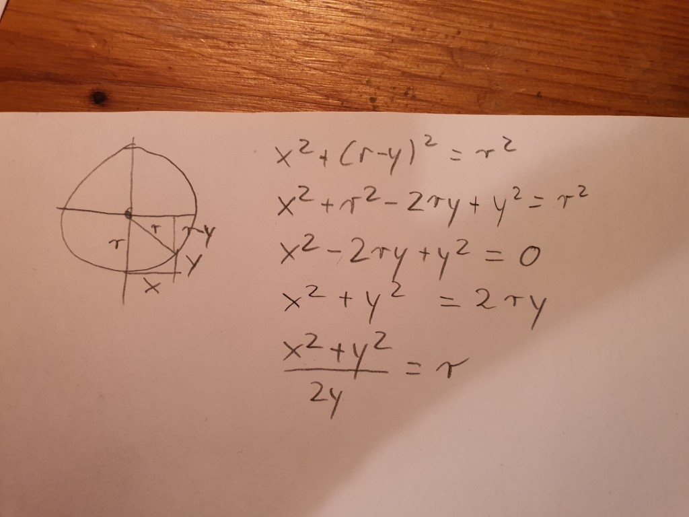

## Measure the curvature

Remember working with paper back in elementary school? Today we find out why we learned all
this. Kids, today we are going to build us a measurement stand...

## Why?

The idea is that we assume that a sole has to curves (front to back, left to right). These curves
are each part of a circle. If we determine the circle (defined by its radius), we have a model to 
work from.

## Building it

- print out the [template.pdf](cimg/template.pdf)
  

There is unnecessary stuff on it, but we can still use it

- add measurements at the described positions, the blue numbers. I used cm, but you can also use
  inches, or better quarter of inches. Just remember what you used.

  

- Fold back along F1. Unfold.
- Fold back along F2. Unfold.
- Cuts - all cuts are from the edge, so you might need to extend the drawn lines a bit.
    - Cut along C1. Cut up to F1, but not further.
    - Cut along C2. Cut up to F2, but not further.
    - Cut along C3.

(Ignore the rest of the lines)

You should end up with something like this:

Now, find a table, and get some scotch tape.

- Fold back along F2 to a 90° angle.
- Fold along F1 in a 90° angle.
- Fit this on the corner of a table. Use scotch tape to fix the paper to the table.

Once more, this is what it should like in the end:

## Measure the shoe

(I haven't used a tap shoe here, it is more about the idea)

- Put the right shoe on the paper. Make sure the right edge of the sole is right at the visual
  helper line V1. The point of the shoe should be right at the line where the two pieces of paper
  come together. The left edge of the sole should touch the table. Put some weight on the shoe if
  necessary.

  

- Take a picture from the right. The whole point is to make the curvature of the shoe measurable. To
  do this, have the lens of the camera on the level of the table surface, and so that the point of
  the shoe visually just touches the vertical measurement bar. Also measure the distance from 
  the point where sole touches the table to tip of the shoe (or the vertical bar). This gives us
  LENGTH

  

- Now reposition the shoe. The point where the sole touches the floor should be right at the 
  edge of the table. The right edge of the shoe should still be on line V1. Measure along the 
  table edge the distance from vertical bar to the opposite edge of the sole. This gives us WIDTH.

  

- Now take a picture from the front. The same idea applies:
  - Camera level with the table surface
  - The right side of the shoe should visually touch the vertical measurement bar. The left edge
      of the sole should touch the table. Put some weight on the shoe if necessary.

  

Now we have four measurements:

1. LENGTH
2. Height of the curve measured from the side
3. WIDTH
4. Height of the curve measured from the bottom. 

## Using the data

We can now progress to middle school. Hurray. I guess the math looks roughly like this (but it has
been ages ago, and I only did a bit of law and sociology after school, so its probably wrong):

- e.g. x is WIDTH, y is the 'height' of the curve. We can now calculate r to be large number of 
  meters.

Or one just skips the math, and probably has some sample curves on paper. :-)

## Other ways

One could probably just put the shoe in the described positions, and hold a yard stick in the 
desired positions, and take photos with the other hand. With my mobile that would require a 
third hand though :-). Or one could use scotch tape to stick the yard stick to the table. Or 
just do measurements, and write them down.

