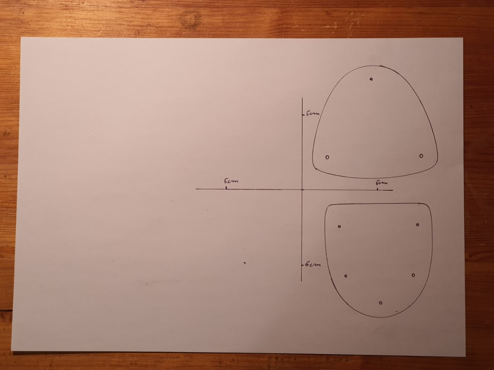
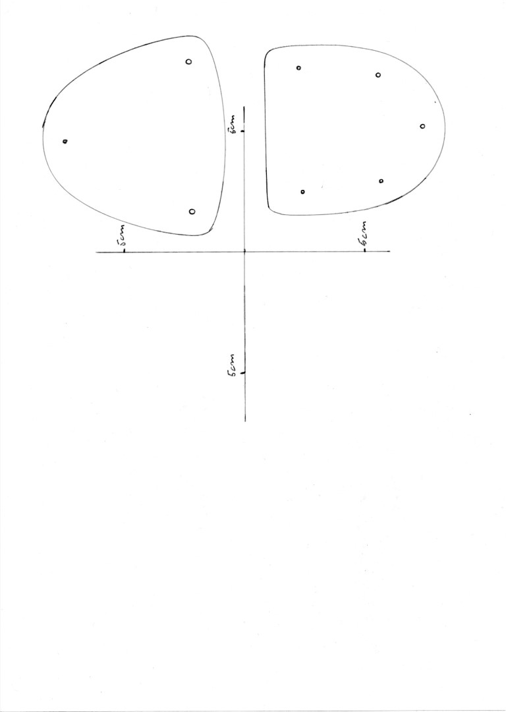
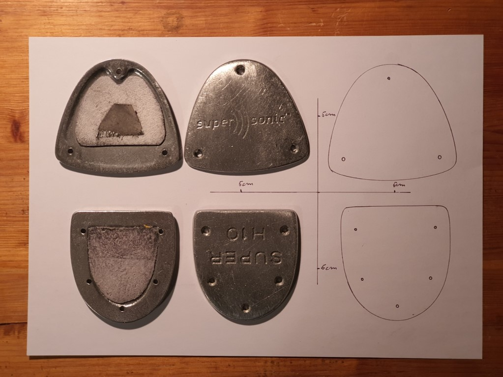
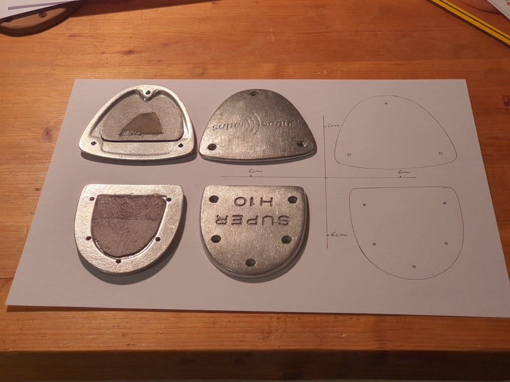
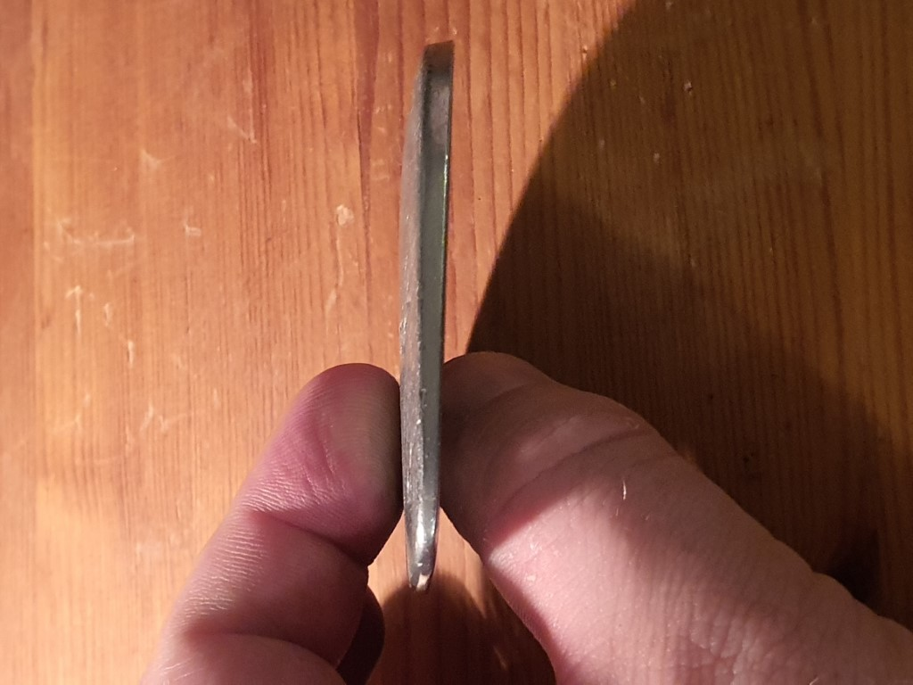
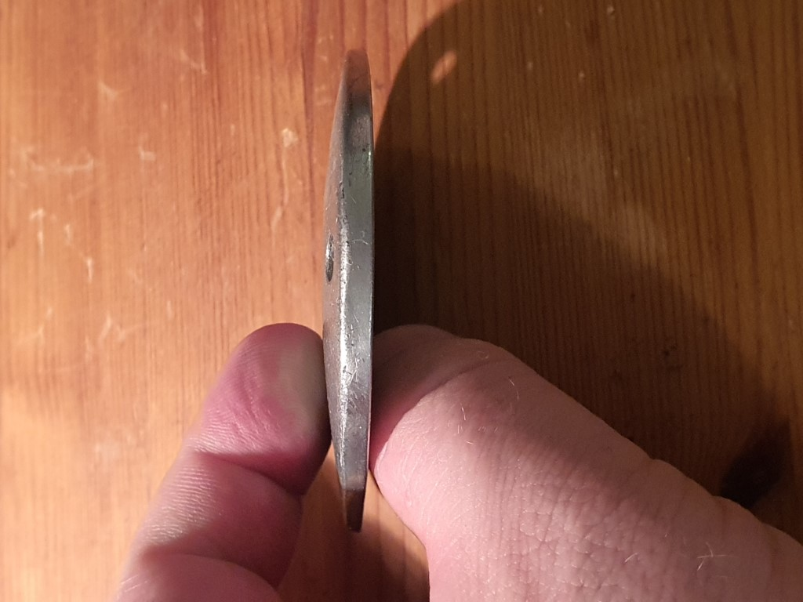

## Instructions for the drawings and images of your taps.

In order to create your custom wooden taps, some drawings and photos are required. 
It is easy process, and we do it together step by step :-)

### 1. Basic drawing

We need a scaled outline drawing of your taps. This is what the wooden taps are created 
from.  It looks like this:

How do we get there?

1. Draw a rectangular cross on the right side of a sheet of paper, with enough
   space for your taps on the right of the cross.
   
2. Mark points in all directions either 5 cm or two inches away from the center. This
   is the most crucial step!
   
3. Draw the outlines of your front and heel taps, and don't forget the holes. Make the line
   quite tight. 
   
### 2. Scan of the drawing

The drawing is crucial, and it is important to get it accurately transported. Find a scanner
and scan it in its original size. Best is, if you scan it to a pdf, like here: [scan.pdf](scan.pdf)

Alternatively you can scan it to an image, which then looks like this:

It is really important to use a proper scanner, and not your mobile phone camera. If you don't have
one, please ask a friend, or a copy shop, or use a fax machine. Using a mobile phone camera will
distort the image, and the wooden taps will come out in the wrong shape!

### 3. Combined photo

Last, we need a photo of your real taps as well:

(My taps have little pieces of leather glued in, to slightly soften the sound, you don't need those)

This image helps to get a better understanding of the shape of the taps.

Make sure that you take the picture right from above. What we **don't want** is a distorted shot 
like this:

This would give a complete wrong impression.

### 4. Side and front shots

Last but not least we need some front and side shots of the taps. These are to give a rough idea
of the shape. Try to take the pictures looking straight at the taps.

From the side:

From the front:

### 5. Send it all off

Now send an email with the files (the scan as image or pdf, and the three images with all taps, 
side shot and front shot) to woodentaps (at) gmail.com.

